## Bienvenida

Este manual te enseña, paso a paso y con imágenes, a usar la plataforma de gestión jurídica de **KOOP Strategic Advisory**. No necesitas saber de tecnología: cada tarea está explicada como una receta, con los botones exactos que verás en pantalla.

**¿Para quién es?**

| Si eres… | Lo más importante para ti |
|---|---|
| **Administrador** (socio o dirección) | Todo el manual. Solo tú administras usuarios y clientes (capítulos 2 y 7). |
| **Abogado o asistente jurídico** | Capítulos 1, 3, 4 y 5: expedientes, tareas y la consulta diaria de procesos. |
| **Cliente de la firma** | Capítulo 8: cómo crear tu cuenta y ver tus casos. |

**Cómo leer las imágenes.** Las capturas traen recuadros rojos con números. Cada número corresponde a un paso o a una parte de la pantalla que se explica justo debajo de la imagen.

> **Recuerda:** los nombres de personas, expedientes y radicados de este manual son **ejemplos inventados**. No corresponden a clientes reales de la firma.

---

## 1. Primeros pasos

### 1.1 Entrar al sistema

1. Abre la página de KOOP en tu navegador (Edge, Chrome o Firefox).
2. Arriba a la derecha pulsa el botón **CLIENTE KOOP**.

3. Escribe tu **correo** (1) y tu **contraseña** (2) y pulsa **Iniciar sesión** (3).

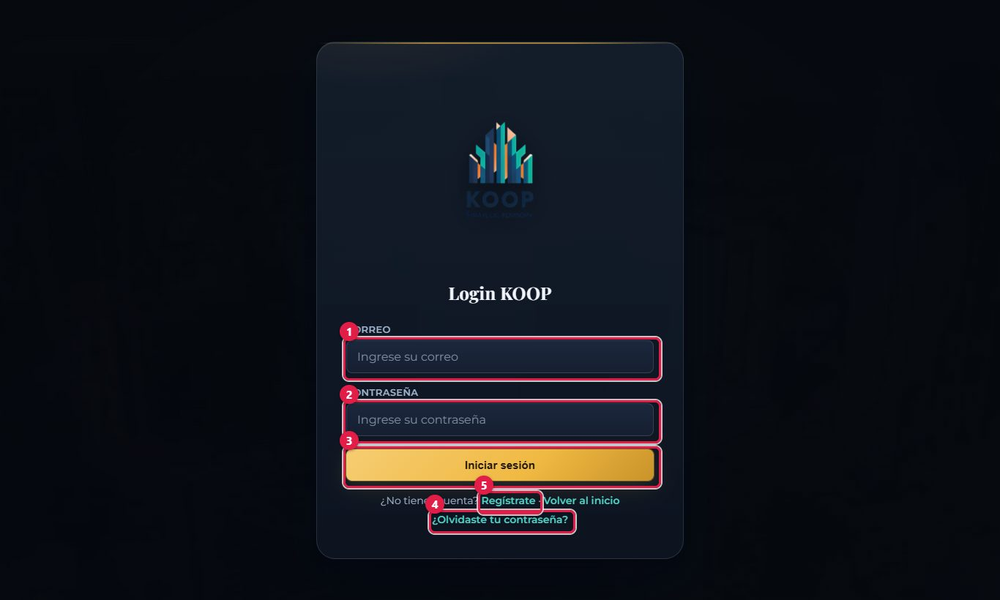

| N.º | Qué es |
|---|---|
| 1 | Tu correo electrónico, el mismo con el que te dieron acceso. |
| 2 | Tu contraseña. |
| 3 | Botón para entrar. |
| 4 | Enlace para recuperar la contraseña si la olvidaste (ver 1.2). |
| 5 | Enlace para crear una cuenta nueva (ver capítulo 8). |

Si todo está bien, llegas a tu **Perfil**, la pantalla de inicio de la plataforma (ver 1.4).

> **Ojo:** después de **5 intentos fallidos** el sistema bloquea la cuenta durante 15 minutos por seguridad. Si te pasa, espera y vuelve a intentar, o usa "¿Olvidaste tu contraseña?".

Si escribes mal el correo o la contraseña verás un aviso rojo. Revisa los datos y vuelve a intentar:

### 1.2 Recuperar la contraseña

1. En la pantalla de ingreso pulsa **¿Olvidaste tu contraseña?**
2. Escribe tu correo (1) y pulsa **Enviar enlace** (2).

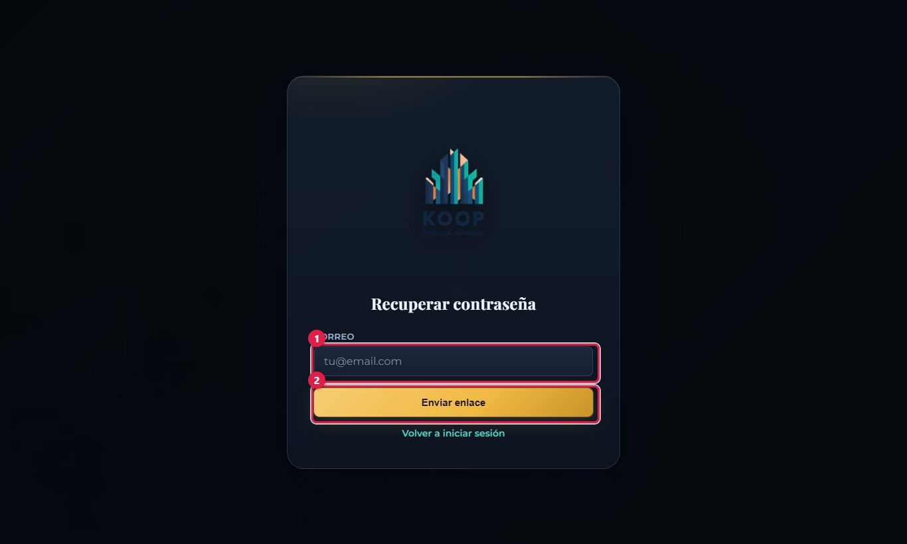

3. Aparecerá un mensaje confirmando el envío.

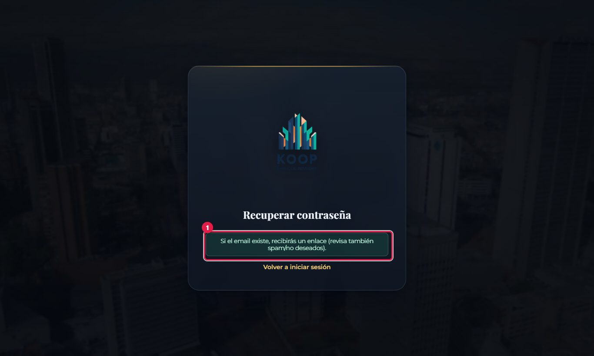

4. Abre tu correo y pulsa el botón **Restablecer contraseña**. Si no lo ves en un par de minutos, **revisa la carpeta de spam**.
5. Escribe la contraseña nueva **dos veces** (mínimo 8 caracteres) y pulsa **Restablecer contraseña**. Te llevará de nuevo al ingreso.

> **Importante:** el enlace del correo **vence en 1 hora** y solo sirve una vez. Si venció, repite el proceso desde el paso 1.

> **Consejo:** por seguridad, el sistema responde siempre lo mismo, exista o no el correo. Así nadie puede averiguar quién tiene cuenta.

### 1.3 Crear una cuenta (registro)

Esta opción es para **clientes de la firma** que quieren consultar sus casos. Está explicada en el capítulo 8.

### 1.4 Tu perfil (pantalla de inicio)

Al entrar llegas a tu **Perfil**. Desde aquí puedes ir a todo lo demás.

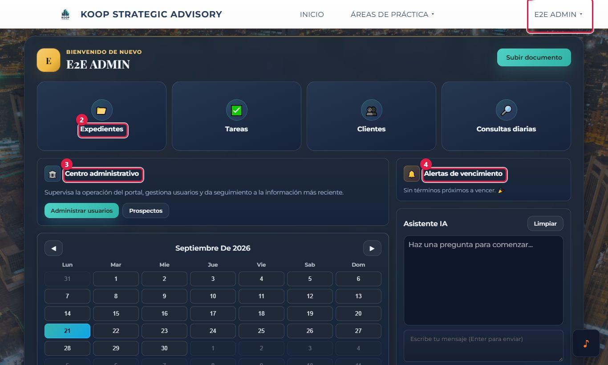

| N.º | Qué es |
|---|---|
| 1 | Tu menú de usuario (ver 1.5). |
| 2 | Accesos directos grandes: **Expedientes**, **Tareas**, **Clientes** y **Consultas diarias**. |
| 3 | **Centro administrativo** (solo administradores): gestionar usuarios y ver prospectos. |
| 4 | **Alertas de vencimiento**: te avisa de términos y tareas próximas a vencer. |

Más abajo encuentras un **calendario** con tus anotaciones y un **Asistente IA** para hacer preguntas.

### 1.5 El menú de usuario

Pulsa tu nombre en la esquina superior derecha para abrir el menú. Ahí están todas las secciones:

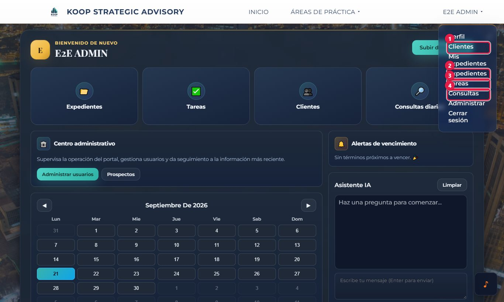

| Opción | Para qué sirve |
|---|---|
| **Perfil** | Volver a tu pantalla de inicio. |
| **Clientes** | Directorio de clientes (solo administradores). |
| **Mis expedientes** | Los expedientes en los que eres el abogado responsable. |
| **Expedientes** | Todos los expedientes de la firma. |
| **Tareas** | Tablero de tareas del equipo. |
| **Consultas** | La consulta diaria de procesos en portales judiciales. |
| **Administrar** | Gestión de usuarios (solo administradores). |
| **Cerrar sesión** | Salir de forma segura. |

> **Consejo:** si trabajas en un computador compartido, cierra siempre la sesión al terminar.

---

## 2. Clientes

*Esta sección la ven solo los administradores.*

Un **cliente** es la persona o empresa a la que la firma representa. Cada expediente pertenece a un cliente, así que **primero se crea el cliente y después el expediente**.

### 2.1 Ver y buscar clientes

Abre el menú de usuario y elige **Clientes**.

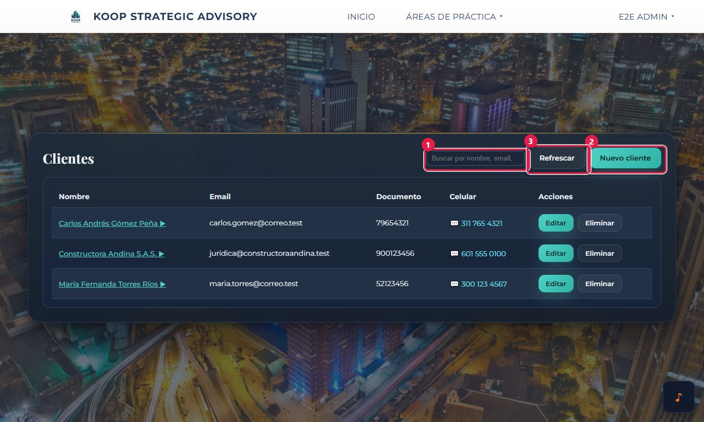

| N.º | Qué es |
|---|---|
| 1 | Buscador: escribe parte del nombre, correo, documento o celular. |
| 2 | **Nuevo cliente**: abre el formulario para crear uno. |
| 3 | **Refrescar**: vuelve a cargar la lista. |

Cada fila muestra el nombre, el correo, el documento y el celular. El celular es un enlace: al pulsarlo se abre **WhatsApp** con un mensaje listo para escribirle al cliente. Al final de la fila están los botones **Editar** y **Eliminar**.

Para encontrar a alguien, escribe en el buscador y la lista se filtra al instante:

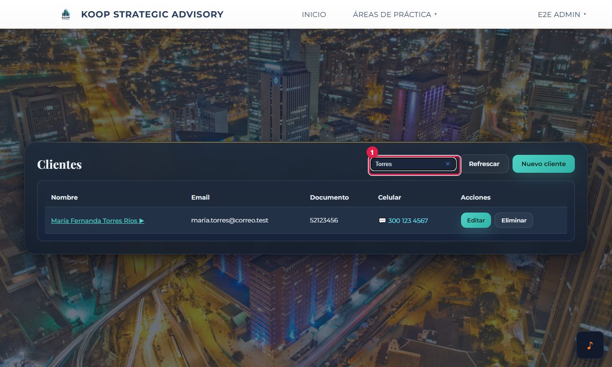

> **Consejo:** al pulsar el **nombre** de un cliente (el que tiene la flecha ▶) se despliegan **sus expedientes** y sus archivos recientes, sin salir de la pantalla.

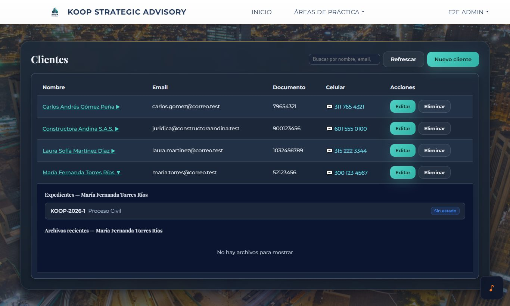

### 2.2 Crear un cliente

1. Pulsa **Nuevo cliente**.
2. Llena el formulario:

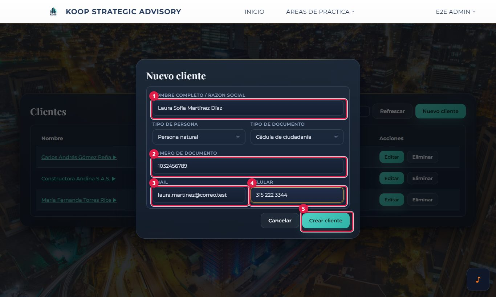

| N.º | Campo | Notas |
|---|---|---|
| 1 | **Nombre completo / razón social** | **Obligatorio.** Persona natural o nombre de la empresa. |
| 2 | **Número de documento** | Cédula o NIT. Ayuda a vincular su cuenta cuando se registre en el portal. |
| 3 | **Email** | Importante: a este correo se envía el enlace para activar su cuenta. |
| 4 | **Celular** | Se usa para el enlace de WhatsApp. |
| 5 | **Crear cliente** | Guarda el cliente. |

También puedes elegir el **tipo de persona** (natural o jurídica) y el **tipo de documento** (CC, NIT, etc.).

3. Verás el aviso **"Cliente creado correctamente"** y el cliente aparece en la lista.

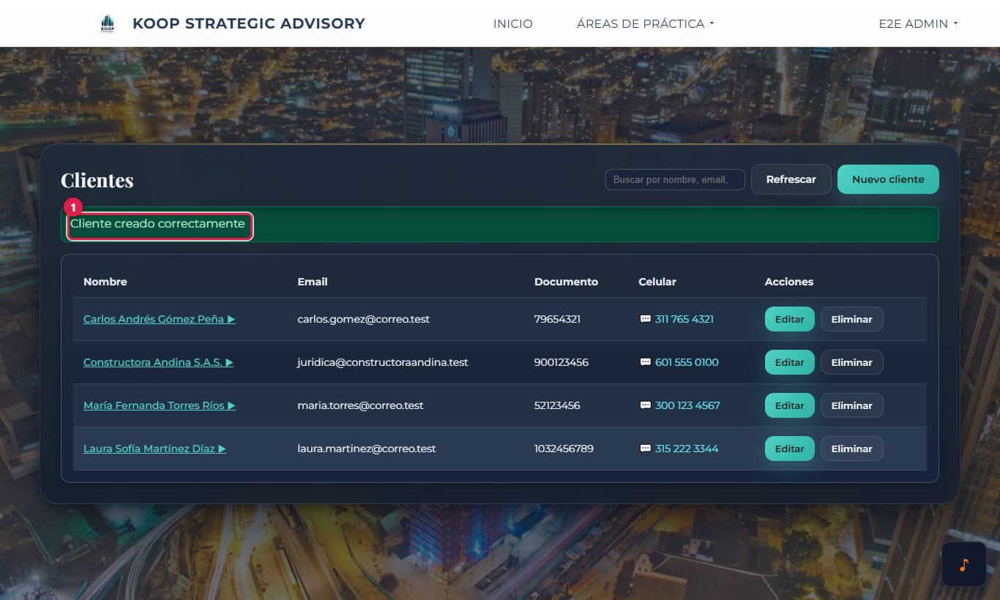

> **Ojo:** si dejas el nombre vacío, el sistema no crea el cliente y te avisa **"El nombre es obligatorio"**.

> **Importante:** escribe bien el **documento** y el **correo**. Así, cuando el cliente se registre en el portal, el sistema lo reconoce y le muestra sus casos automáticamente.

---

## 3. Expedientes

Un **expediente** es el "folder digital" de un caso: guarda sus datos, actuaciones, audiencias, tareas y documentos.

### 3.1 La lista de expedientes

Abre el menú de usuario y elige **Expedientes**.

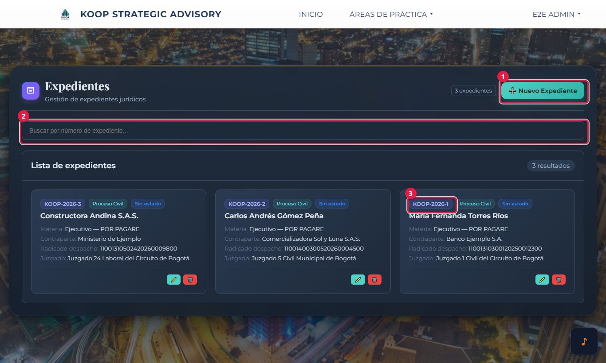

| N.º | Qué es |
|---|---|
| 1 | **Nuevo Expediente**: abre el asistente de creación. |
| 2 | Buscador por número de expediente. |
| 3 | El número interno de KOOP (por ejemplo **KOOP-2026-1**). |

Cada tarjeta resume el caso: cliente, materia, contraparte, radicado del despacho y juzgado. Con el **lápiz** editas y con la **papelera** eliminas. Al pulsar la tarjeta abres el **detalle** del expediente (ver 3.3).

> **Consejo:** en **Mis expedientes** ves solo los tuyos, en los que eres el abogado responsable.

### 3.2 Crear un expediente (asistente de 3 pasos)

Pulsa **➕ Nuevo Expediente**. Un asistente te guía por tres pasos. Los botones **Siguiente →** solo se activan cuando llenaste lo obligatorio.

#### Paso 1 · Datos básicos

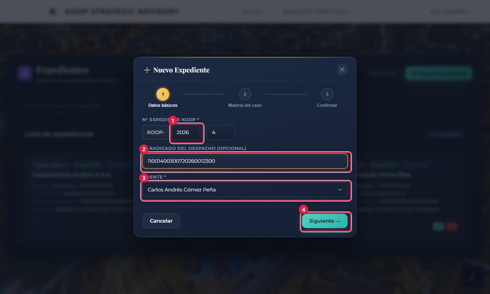

| N.º | Qué hacer |
|---|---|
| 1 | **N.º de Expediente KOOP**: escribe el **año** (por ejemplo 2026) y el **consecutivo**. El sistema sugiere el siguiente número libre. |
| 2 | **N.º de Radicado del despacho** (opcional): los 23 dígitos que asigna el juzgado. Escríbelo si ya lo tienes: lo necesitarás para la consulta diaria. |
| 3 | **Cliente**: elige de la lista al cliente dueño del caso. |
| 4 | **Siguiente →** para continuar. |

> **Ojo:** el cliente tiene que existir antes. Si no aparece en la lista, créalo primero (capítulo 2).

#### Paso 2 · Materia del caso

Elige el tipo de caso en cascada: primero el **Tipo de proceso** (Civil, Laboral, Penal…), luego el **Subtipo** y por último el **Tipo de pretensión**. Cada lista se llena según lo que elegiste antes.

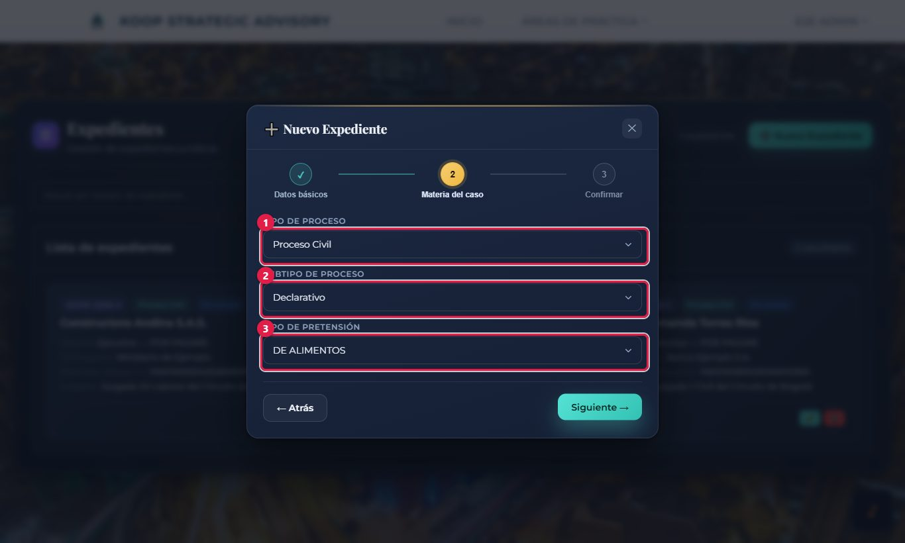

#### Paso 3 · Confirmar

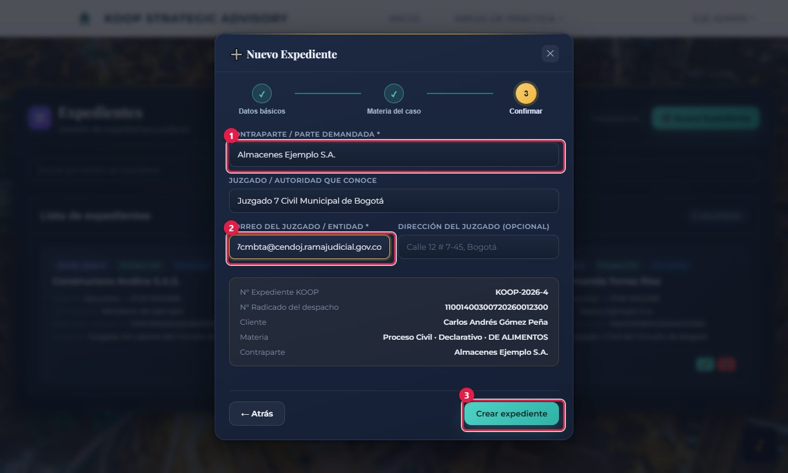

| N.º | Qué hacer |
|---|---|
| 1 | **Contraparte / Parte demandada** (obligatorio): contra quién es el caso. Es texto libre. |
| 2 | **Correo del juzgado / entidad** (obligatorio): el correo donde se les escribe. |
| 3 | **Crear expediente**. |

Abajo verás un **resumen** con todo lo que escribiste. También puedes indicar el **juzgado** y su **dirección** (opcional).

Al terminar aparece el aviso **"Expediente creado exitosamente"**:

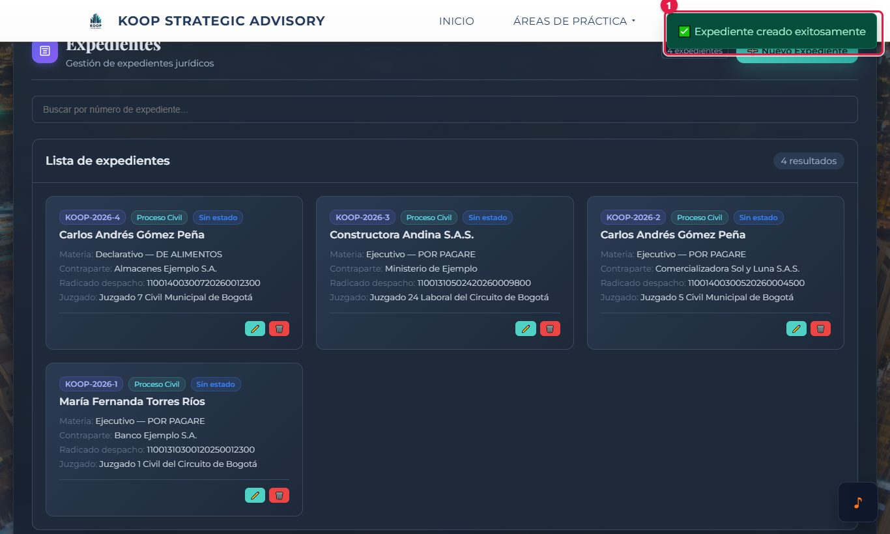

> **Consejo:** al crear el expediente, el sistema **arma solo las etapas y tareas típicas** de ese tipo de trámite (si ya existe la plantilla). Te ahorra crearlas una por una.

### 3.3 El detalle de un expediente

Pulsa cualquier tarjeta de la lista para abrirlo. Arriba ves los datos principales; abajo, seis **pestañas**.

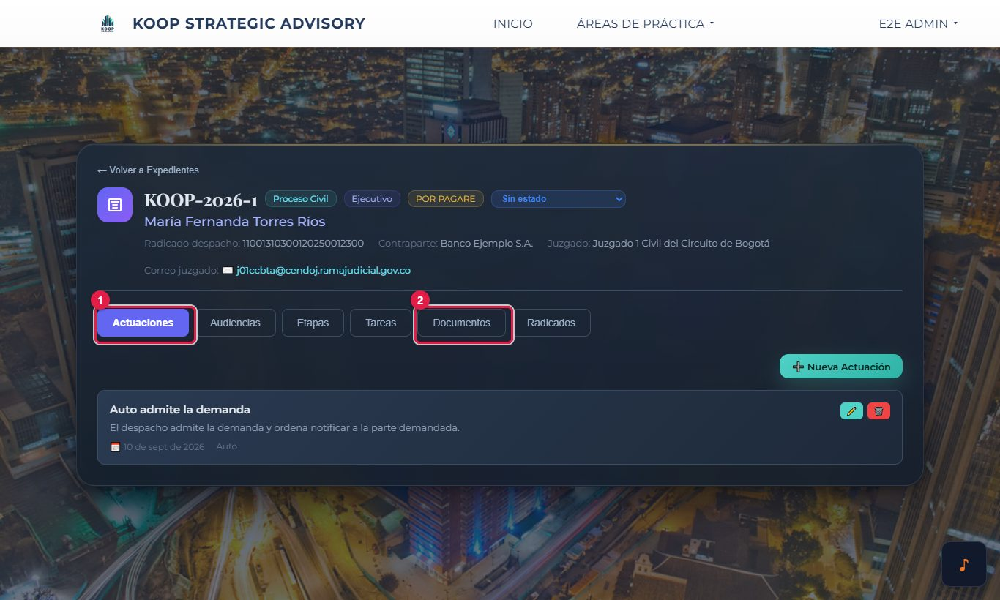

En el encabezado encuentras:

- El **número** del expediente y etiquetas con la **materia**.
- El **cliente** y el **radicado del despacho**, la **contraparte** y el **juzgado**.
- El **correo del juzgado**: al pulsarlo se abre tu programa de correo con el asunto ya escrito con el radicado.
- El **estado del proceso** (lista desplegable) que puedes cambiar cuando el caso avance.

Las pestañas (en la imagen, 1 señala **Actuaciones** y 2 señala **Documentos**):

| Pestaña | Para qué sirve |
|---|---|
| **Actuaciones** | El historial de lo que ha pasado en el proceso: autos, sentencias, memoriales. |
| **Audiencias** | Las audiencias programadas y celebradas. |
| **Etapas** | Las fases del trámite, en orden. |
| **Tareas** | Lo que hay que hacer en este caso. |
| **Documentos** | Los archivos del caso. |
| **Radicados** | Los números de radicado en cada portal judicial. |

#### Actuaciones

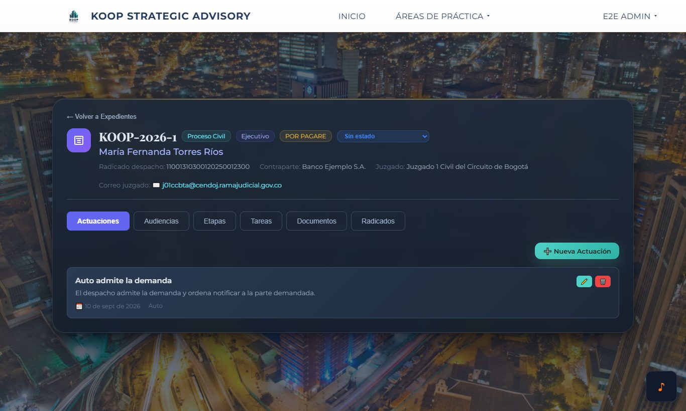

Pulsa **Nueva Actuación** para registrar algo que ocurrió en el proceso. Necesitas la **fecha**, un **título** y el **tipo de actuación** (Auto, Sentencia, Providencia…). Puedes añadir una descripción.

#### Audiencias

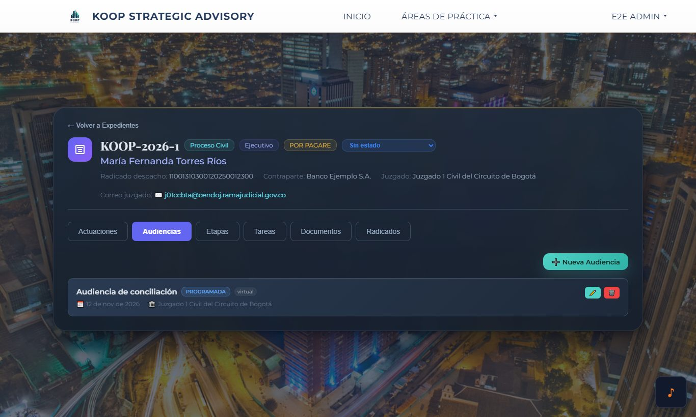

Pulsa **Nueva Audiencia**. El **tipo** y la **fecha programada** son obligatorios. Puedes indicar la hora, si es presencial, virtual o mixta, el juzgado y, si es virtual, el **enlace** de la reunión. Cuando la audiencia se celebra, cambia su estado a *celebrada* y anota el **resultado**.

#### Etapas

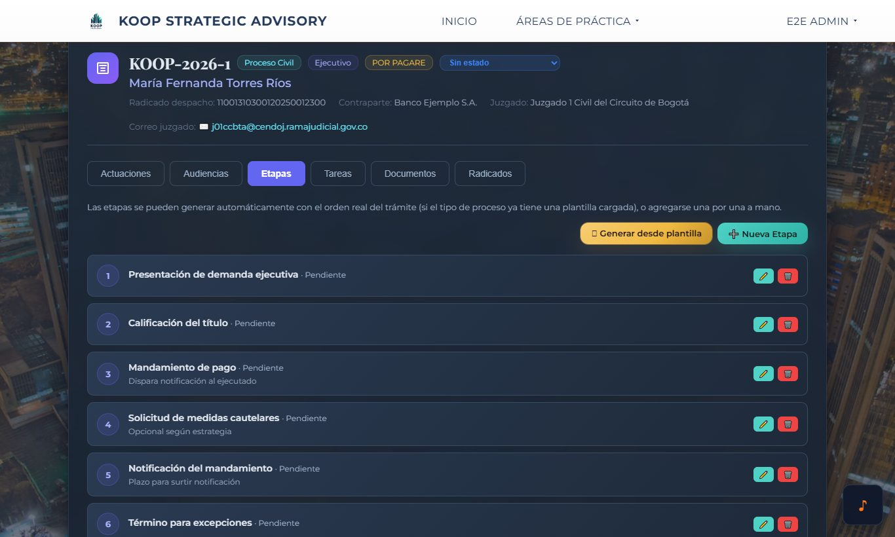

Las etapas muestran el camino del trámite (por ejemplo: presentación de la demanda, mandamiento de pago, notificación…). Tienes dos opciones:

- **Generar desde plantilla**: crea automáticamente las etapas típicas del tipo de proceso.
- **Nueva Etapa**: agrega una a mano (necesita **orden** y **estado**).

#### Tareas

Las tareas de este expediente. Se explican a fondo en el capítulo 4.

#### Documentos

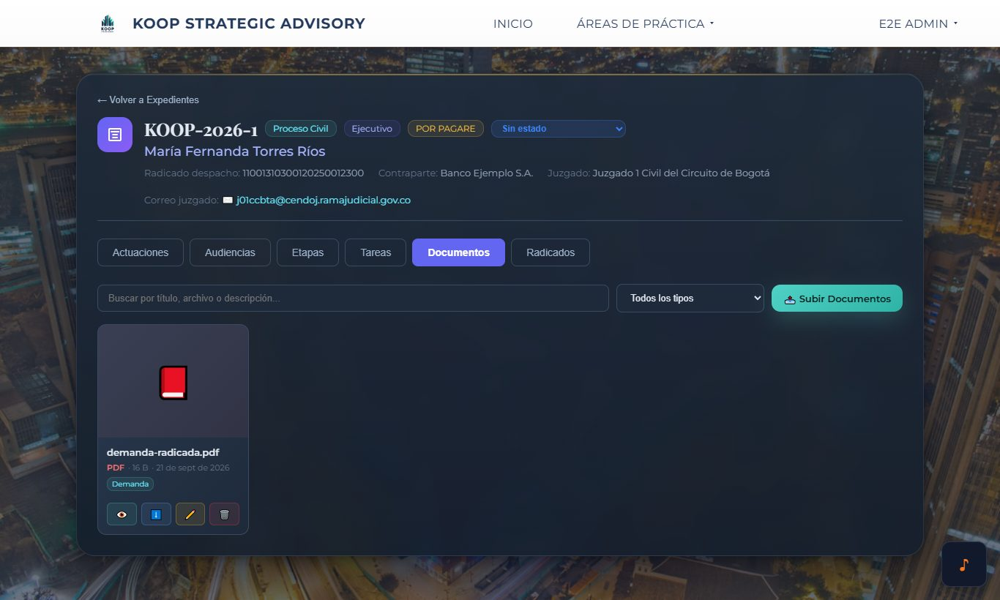

Aquí se guardan los archivos del caso: demanda, poderes, pruebas, autos. Cada documento tiene cuatro botones: **ver** (👁️), **descargar** (⬇️), **editar** (✏️) y **eliminar** (🗑️).

Para subir archivos:

1. Pulsa **Subir Documentos**.
2. Elige uno o **varios archivos** a la vez (máximo **25 MB** cada uno).
3. Selecciona el **tipo de documento** (obligatorio).
4. Opcional: título, fecha, descripción y la casilla **"Visible para el cliente"**.
5. Pulsa **Subir**.

> **Importante:** un documento solo lo ve el cliente en su portal si marcas **"Visible para el cliente"**. Si no la marcas, es de uso interno de la firma.

> **Ojo:** al **eliminar** un documento se borra también el archivo guardado. No se puede deshacer.

#### Radicados

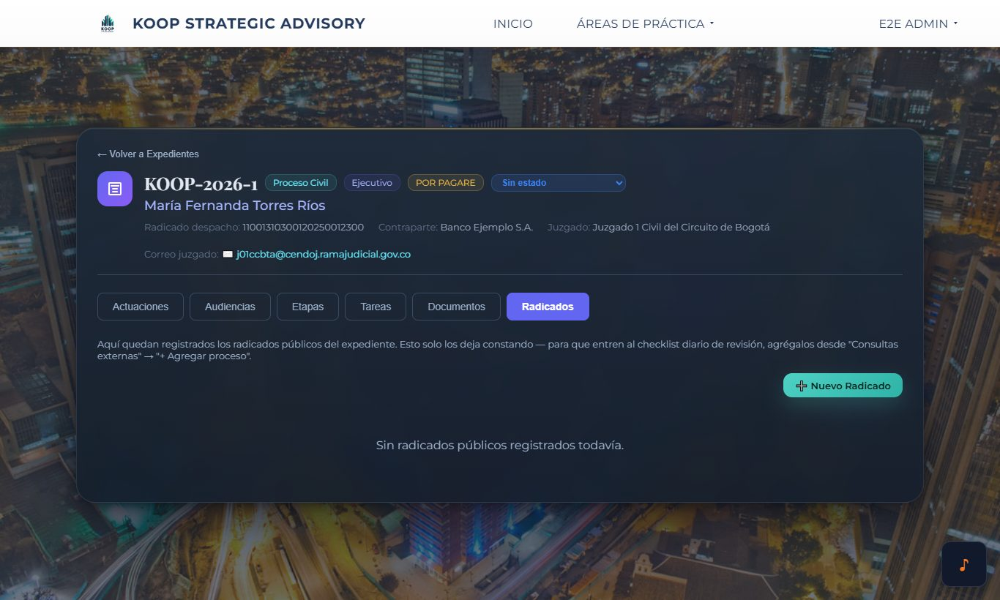

Aquí quedan registrados los números de radicado del caso en cada portal (Rama Judicial, Fiscalía, etc.). **Registrar un radicado aquí solo lo deja constando**: para revisarlo cada día hay que agregarlo desde **Consultas** (capítulo 5).

---

## 4. Tareas

Las tareas son los pendientes del equipo. Se manejan en el **Tablero de Tareas** (menú → **Tareas**).

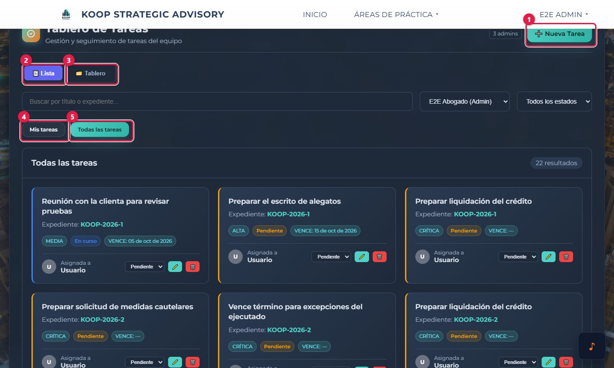

| N.º | Qué es |
|---|---|
| 1 | **Nueva Tarea**. |
| 2 | Vista **Lista**: tarjetas con toda la información. |
| 3 | Vista **Tablero**: columnas por estado (ver abajo). |
| 4 | **Mis tareas**: solo las que te asignaron a ti. |
| 5 | **Todas las tareas**: las de todo el equipo. |

Cada tarjeta muestra el título, el expediente, la **prioridad** (Crítica, Alta, Media, Baja), el **estado** y la fecha de **vencimiento**. Desde la tarjeta puedes cambiar el estado, editar o eliminar la tarea. También puedes **buscar** por título o expediente y **filtrar** por responsable y estado.

### 4.1 Crear una tarea

1. Pulsa **Nueva Tarea**.
2. Llena el formulario.

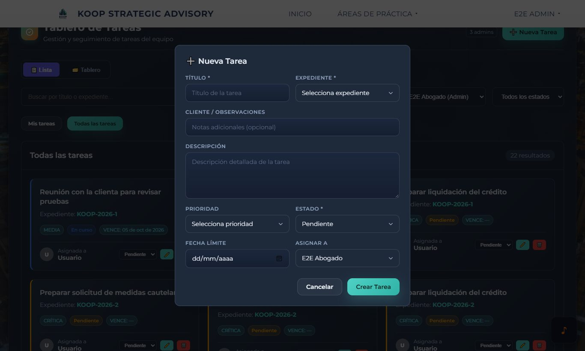

Los datos obligatorios son el **título**, el **expediente** al que pertenece y el **estado**. Además puedes elegir la **prioridad**, el **responsable**, la **fecha límite** y una descripción.

> **Consejo:** también puedes crear tareas desde dentro del expediente, en su pestaña **Tareas**. Ahí el expediente ya viene elegido.

### 4.2 Vista Tablero

La vista **Tablero** funciona como un tablero de notas adhesivas: hay una columna por estado (**Pendiente**, **En curso**, **Completada**, **Vencida**, **Cancelada**) y **arrastras las tarjetas** de una columna a otra para cambiar su estado.

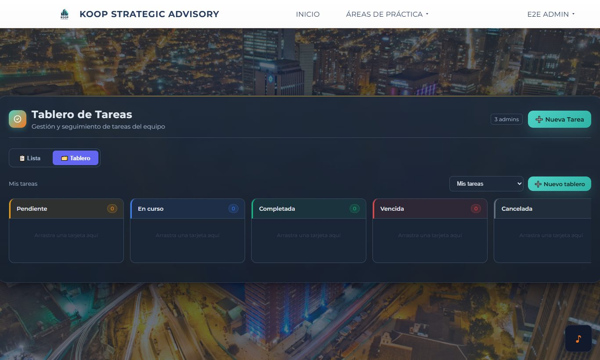

> **Consejo:** puedes crear tableros propios con **Nuevo tablero** para agrupar las tareas como prefieras.

---

## 5. Consulta diaria de procesos

Esta es una de las funciones más importantes de la plataforma. Cada día, la firma debe **revisar los procesos en los portales de la justicia** (Rama Judicial, Fiscalía, etc.) para no perder ninguna novedad ni ningún término. Esta pantalla te ayuda a hacerlo con orden y deja **constancia** de que se hizo.

### 5.1 Cómo funciona (en 30 segundos)

1. **Agregas** a la lista los procesos que quieres revisar cada día. Se quedan ahí **hasta que los retires**.
2. Cada día, **revisas** cada proceso y **registras** el resultado.
3. Cuando todos tienen registro, **generas la bitácora del día** en PDF: es tu constancia.

Hay **dos formas** de revisar un proceso:

| Modalidad | Cómo funciona | Disponible en |
|---|---|---|
| **Manual** | Tú abres la página del portal, buscas el radicado y registras qué encontraste. | Todos los portales. |
| **Automática** | El sistema consulta **solo**, cada día a las **6:00 a.m.** (hora de Bogotá), y **genera el registro por ti**. | Solo **Consulta de procesos Rama Judicial**. |

> **Importante:** los otros portales (Fiscalía, SIUGJ, SuperFinanciera…) piden captcha o clave, así que **no se pueden consultar automáticamente**. Esos se revisan siempre a mano.

Para que un expediente pueda agregarse necesita tener el **radicado del despacho** registrado (paso 1 del asistente de expedientes, ver 3.2).

### 5.2 Agregar un proceso a la lista

Abre el menú → **Consultas**. Si la lista está vacía verás esto:

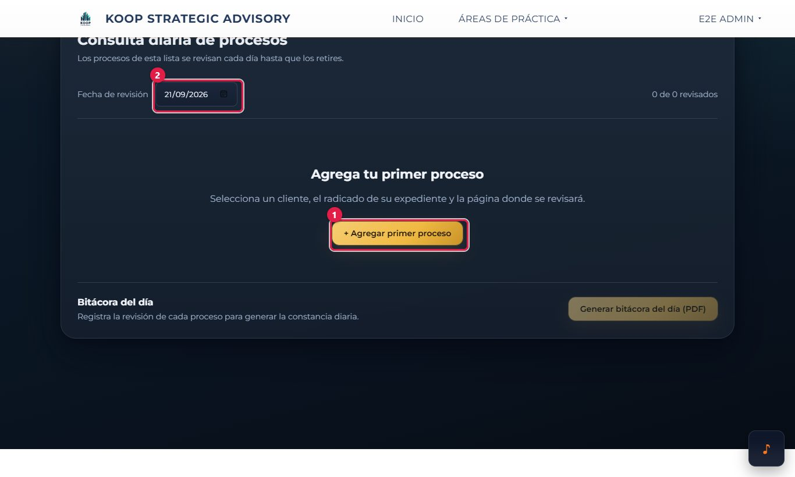

1. Pulsa **+ Agregar primer proceso** (o **+ Agregar proceso** si ya hay otros).
2. **Paso 1 · Cliente:** escribe parte del nombre en el buscador (1) y elige al cliente.
3. **Paso 2 · Expediente:** elige el radicado del expediente (2). Verás un recuadro **"Radicado que se consultará"** (3) con el número exacto.

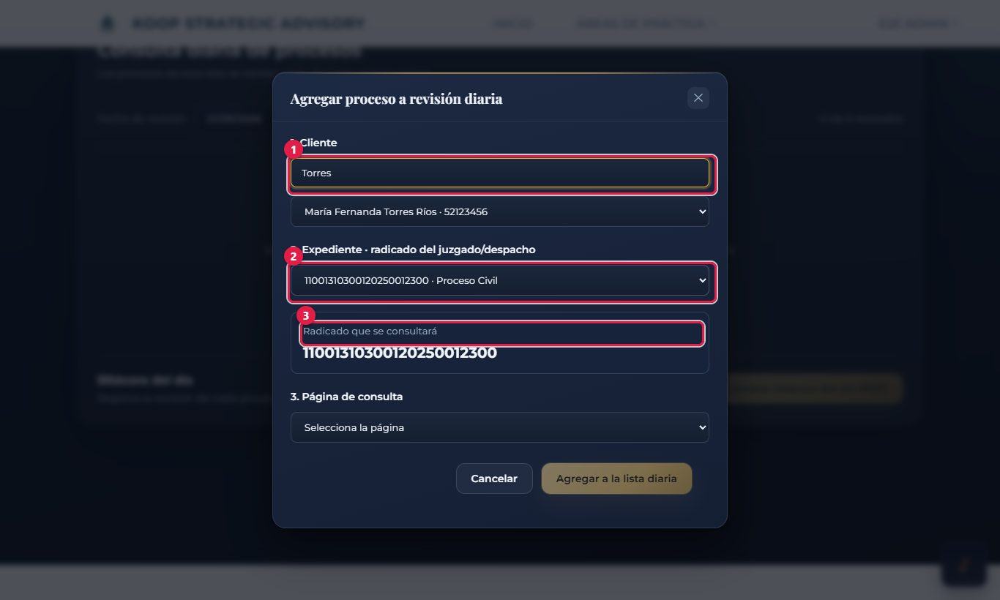

4. **Paso 3 · Página de consulta:** elige el portal (1).
5. **Paso 4 · Modalidad:** si elegiste Rama Judicial, decide entre **manual** o **automática** (2). Para los demás portales es manual y se elige sola.
6. Pulsa **Agregar a la lista diaria** (3).

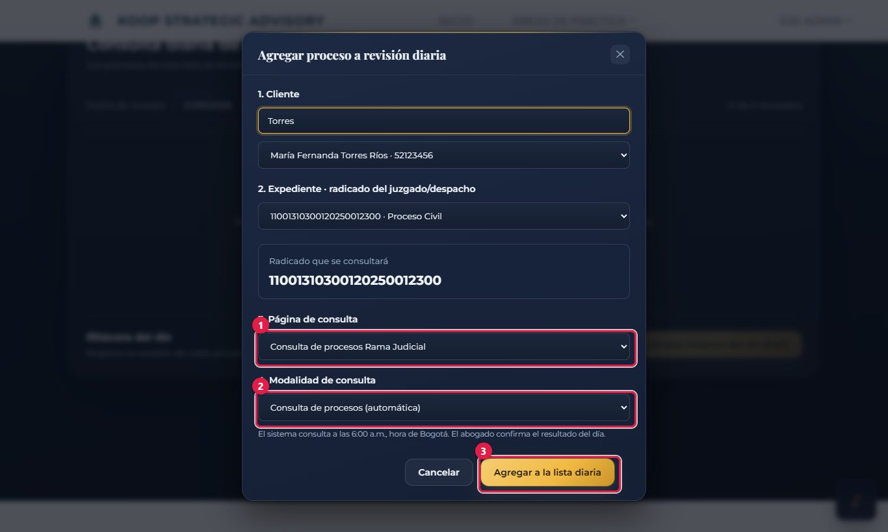

> **Ojo:** el radicado **no se escribe**: el sistema usa el que ya está registrado en el expediente. Así se evitan errores de digitación.

> **Consejo:** si el mismo caso se revisa en varios portales, agrégalo una vez por cada portal.

### 5.3 La lista de hoy

Cada proceso de la lista aparece como una **tarjeta**.

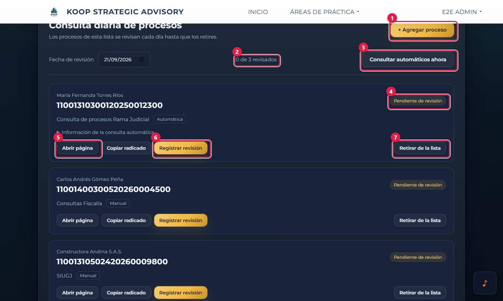

| N.º | Qué es |
|---|---|
| 1 | **+ Agregar proceso**. |
| 2 | Contador: cuántos procesos ya tienen registro hoy. |
| 3 | **Consultar automáticos ahora**: fuerza la consulta automática sin esperar a las 6 a.m. |
| 4 | Estado de la tarjeta: **Pendiente de revisión**. |
| 5 | **Abrir página**: abre el portal en otra pestaña. |
| 6 | **Registrar revisión**: para anotar lo que encontraste. |
| 7 | **Retirar de la lista**: deja de revisar ese proceso. |

Cada tarjeta muestra el **cliente**, el **radicado** en letras grandes, el **portal** y la **modalidad** (Manual o Automática). También tiene el botón **Copiar radicado**, muy útil para pegarlo en el portal.

> **Consejo:** en la fecha de la parte superior puedes **ver los días anteriores**, pero solo puedes registrar, corregir o retirar procesos **del día de hoy**. El pasado queda fijo como constancia.

### 5.4 Revisión automática (Rama Judicial)

Los procesos en modalidad **Automática** se consultan solos a las 6:00 a.m. También puedes pulsar **Consultar automáticos ahora**. El sistema busca la **última actuación** en el portal y **genera el registro del día** con tres datos:

- la **fecha de la actuación**,
- la **actuación** (por ejemplo, "Oficio Enviado Virtualmente"),
- la **anotación** (por ejemplo, "RADICACION OFICIO 629").

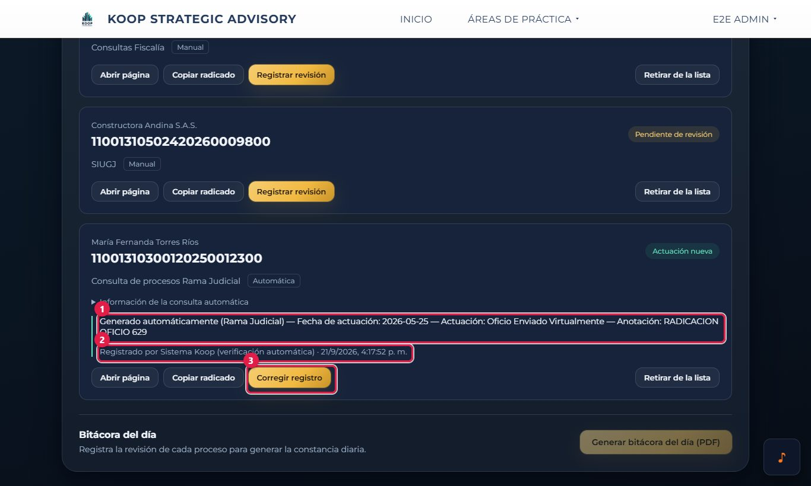

| N.º | Qué es |
|---|---|
| 1 | El registro que generó el sistema: fecha de actuación, actuación y anotación. |
| 2 | Quién lo firmó y a qué hora: **Sistema Koop (verificación automática)**. |
| 3 | **Corregir registro**, por si algo no coincide con la realidad. |

El registro queda **firmado por "Sistema Koop"** (no por una persona), para que en la constancia se distinga qué revisó el sistema y qué revisó un abogado. Si el sistema encuentra una actuación **nueva** (distinta a la que ya conocía), el resultado es **Actuación nueva**; si no hay cambios, es **Sin movimiento**.

> **Ojo:** el sistema solo consulta mientras el servidor está encendido. Si estuvo apagado a las 6:00 a.m., ese día pulsa **Consultar automáticos ahora**.

> **Consejo:** si lo que registró el sistema no coincide con la realidad, pulsa **Corregir registro** y ajústalo (ver 5.6).

### 5.5 Revisión manual

1. En la tarjeta pulsa **Abrir página** y busca el radicado (usa **Copiar radicado** para pegarlo).
2. Vuelve a la plataforma y pulsa **Registrar revisión**.
3. Elige el **Resultado** (1) y, si quieres, escribe las **Observaciones** (2).
4. Pulsa **Guardar revisión** (3).

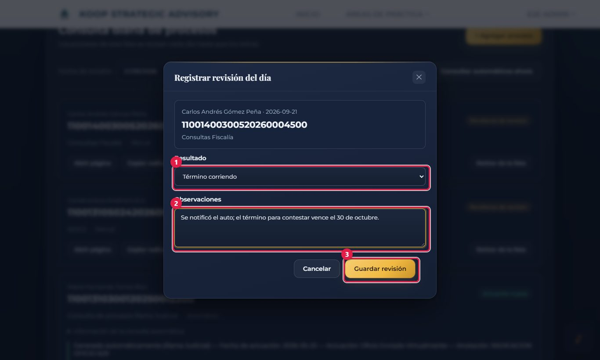

Los tres resultados posibles son:

| Resultado | Cuándo usarlo |
|---|---|
| **Sin movimiento** | No hay nada nuevo desde la última vez. |
| **Actuación nueva** | Apareció una actuación (auto, memorial, notificación…). |
| **Término corriendo** | Hay un plazo en marcha. Anótalo en las observaciones con su fecha de vencimiento. |

Al guardar, la tarjeta cambia de estado y muestra **quién** hizo el registro y **a qué hora**:

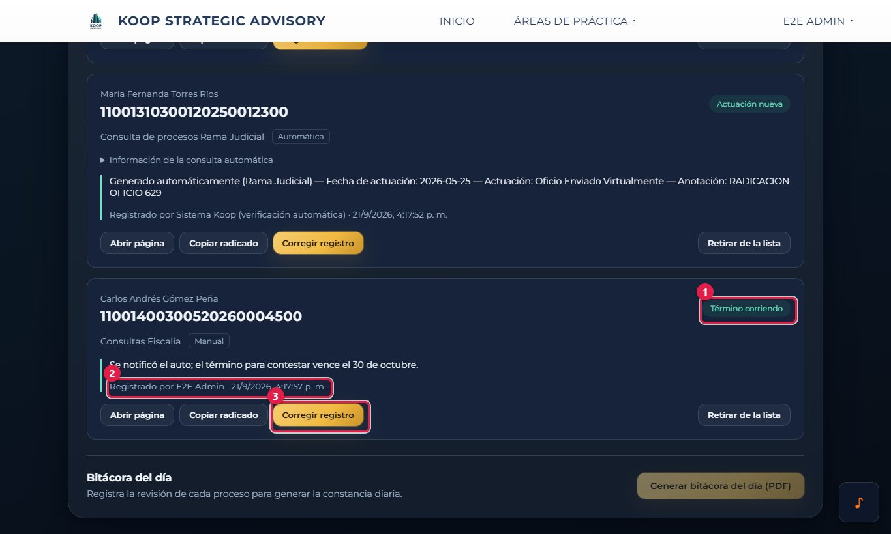

| N.º | Qué es |
|---|---|
| 1 | El resultado que elegiste. |
| 2 | Quién hizo el registro y cuándo. |
| 3 | **Corregir registro** (ver 5.6). |

### 5.6 Corregir un registro

Si te equivocaste, pulsa **Corregir registro** en la tarjeta, cambia el resultado o la observación y guarda de nuevo. El sistema **conserva la versión anterior** en su historial y usa la última en la constancia.

> **Importante:** solo puedes corregir **el día de hoy**. Los registros de días anteriores no se tocan: son la prueba de que la revisión se hizo.

### 5.7 Retirar un proceso de la lista

Cuando un proceso ya no necesita revisión diaria (terminó, se archivó…), pulsa **Retirar de la lista**.

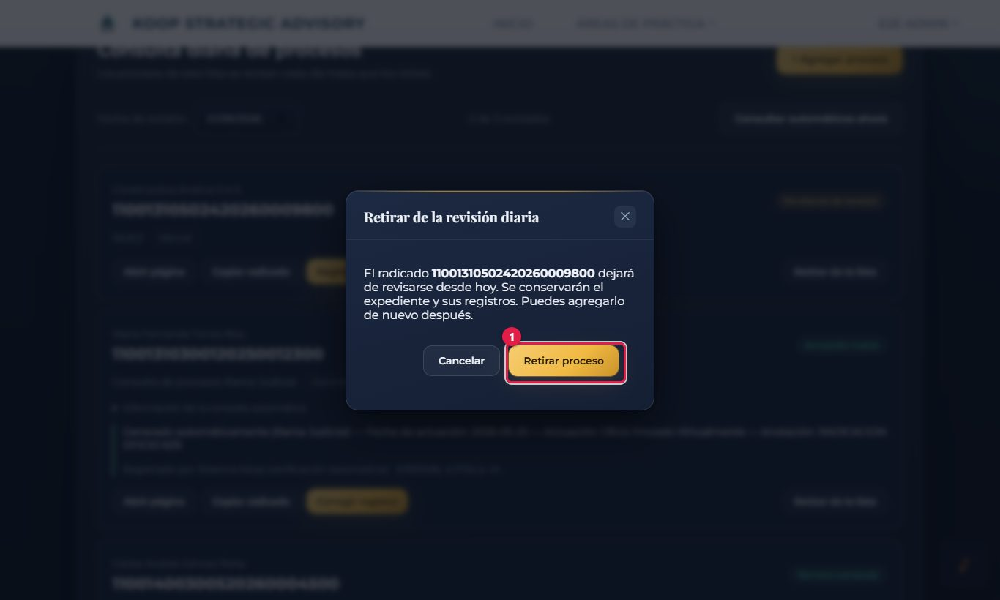

El proceso **deja de aparecer desde hoy**, pero **no se pierde nada**: el expediente y todos sus registros anteriores se conservan. Puedes volver a agregarlo cuando quieras.

### 5.8 Generar la bitácora del día (constancia en PDF)

Cuando **todos** los procesos de la lista tienen registro, el botón **Generar bitácora del día (PDF)** se activa y el sistema muestra *"Todos los procesos tienen registro. La constancia está lista."*

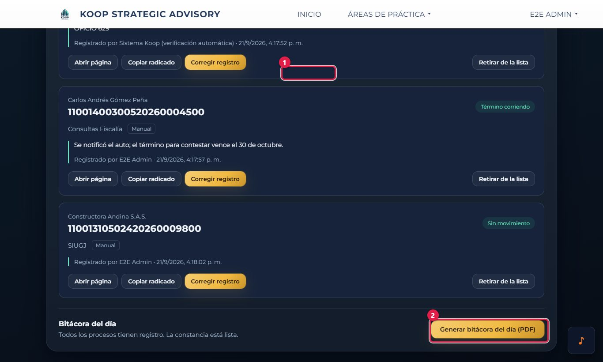

Al pulsarlo:

1. Se **descarga** un PDF llamado `bitacora-diaria-AAAA-MM-DD.pdf`.
2. **Además**, el sistema guarda una copia permanente en la carpeta **`constancias-consultas-externas`** del almacenamiento seguro de la firma. Si generas la bitácora dos veces el mismo día, esa copia se actualiza.

El PDF incluye, por cada proceso: el radicado, las partes, la materia, el juzgado, el portal consultado, el resultado, las observaciones y **quién lo revisó y cuándo**.

> **Ojo:** si falta algún proceso por revisar, el botón está desactivado y el sistema no deja generar la constancia. Es a propósito: la bitácora debe estar **completa**.

---

## 6. Ejemplo de un día típico

Para que veas cómo encajan las piezas:

> **Ejemplo:** *Camila es abogada de la firma y hoy le toca la revisión diaria.*
>
> 1. **8:00 a.m.** Camila entra a **Consultas**. El sistema ya consultó solo, a las 6:00 a.m., los procesos de Rama Judicial y dejó sus registros. Ve *"0 de 3 revisados"* solo en los manuales.
> 2. Abre el portal de la Fiscalía con **Abrir página**, copia el radicado con **Copiar radicado**, lo busca y encuentra que hay un auto nuevo.
> 3. Vuelve y pulsa **Registrar revisión** → **Actuación nueva** → escribe en observaciones lo que dice el auto → **Guardar**.
> 4. Revisa el resto. El contador llega a *"3 de 3 revisados"*.
> 5. Pulsa **Generar bitácora del día (PDF)**. La constancia queda descargada y guardada.
> 6. Como el auto abre un plazo, entra al expediente → pestaña **Tareas** y crea la tarea *"Contestar antes del 30 de octubre"* con prioridad **Alta**.

---

## 7. Administración

*Solo para administradores.*

### 7.1 Usuarios

Desde el **Perfil** pulsa **Administrar usuarios** (o menú → **Administrar**). La pantalla tiene dos secciones:

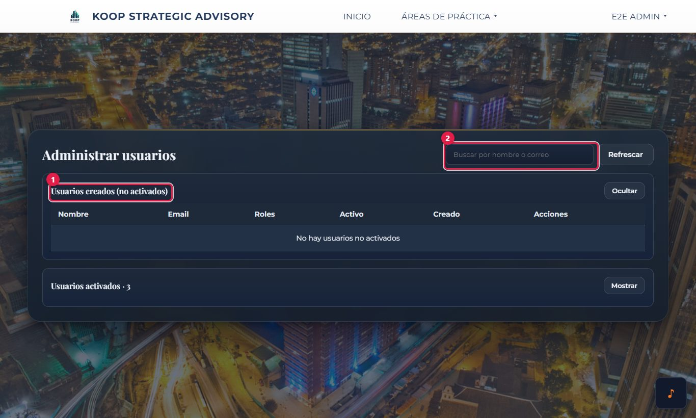

- **Usuarios creados (no activados):** cuentas que aún no pueden entrar. Desde aquí un administrador las **activa**.
- **Usuarios activados:** las cuentas que ya funcionan. Pulsa **Mostrar** para desplegar la lista y ahí puedes asignar **roles** (administrador, abogado, cliente…) o desactivar a alguien.

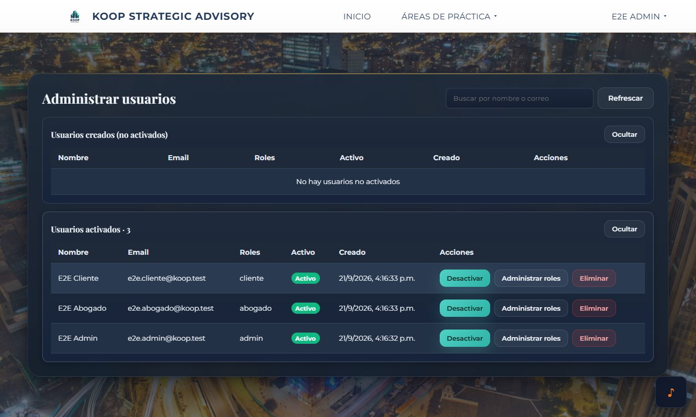

Usa el buscador para encontrar a alguien por nombre o correo.

> **Consejo:** las cuentas internas del sistema (como la que firma la consulta automática) **no aparecen** en esta lista: no son personas y no se pueden editar desde aquí.

Los **roles** definen qué puede hacer cada persona:

| Rol | Qué puede hacer |
|---|---|
| **Administrador** | Todo, incluida la gestión de clientes y usuarios. |
| **Abogado / asociado / junior / paralegal** | Trabajar con expedientes, tareas, audiencias, documentos y la consulta diaria. |
| **Cliente** | Solo ver **sus propios** casos y los documentos que la firma le comparte. |

### 7.2 Prospectos

Un **prospecto** es alguien que se registró en el portal pero cuya cédula **no coincide con ningún cliente** de la firma. Quizás quiere una asesoría. Desde **Perfil → Prospectos** puedes ver sus datos de contacto y decidir si lo contactas o lo **descartas**.

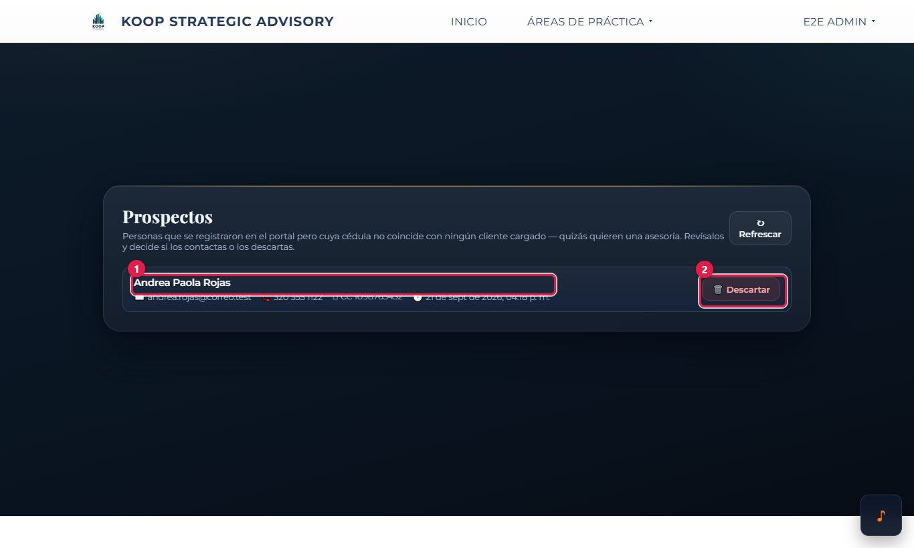

---

## 8. Portal del cliente

Esta sección es para los **clientes de la firma**. Con una cuenta puedes consultar tus casos cuando quieras.

### 8.1 Crear tu cuenta

1. En la pantalla de ingreso pulsa **Regístrate**.
2. Llena el formulario:

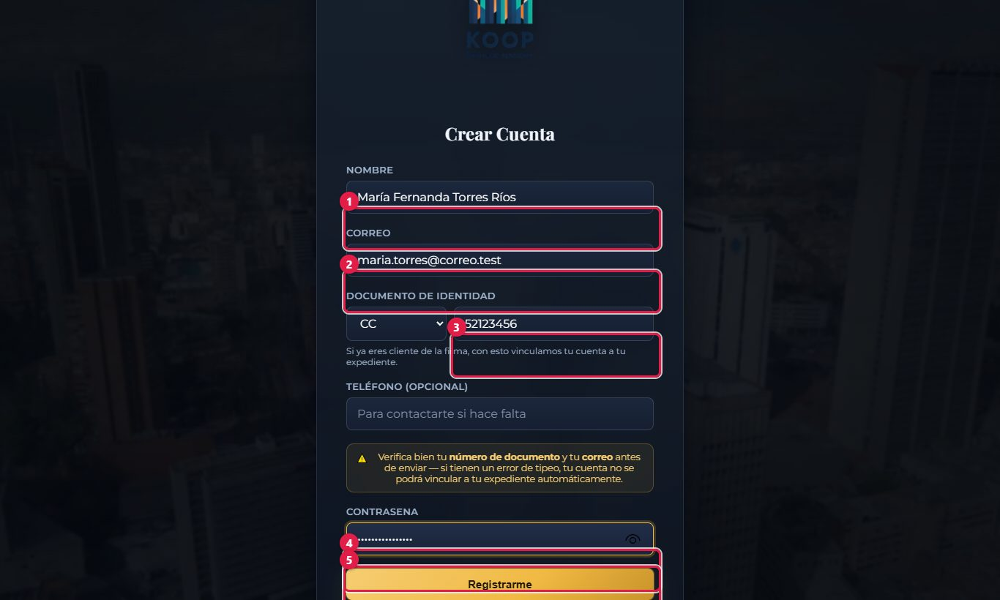

| N.º | Campo |
|---|---|
| 1 | **Nombre** completo. |
| 2 | **Correo** (revísalo bien). |
| 3 | **Documento de identidad**: tipo y número. Con esto el sistema reconoce que ya eres cliente. |
| 4 | **Contraseña** (mínimo 8 caracteres). |
| 5 | **Registrarme**. |

3. Verás un mensaje de que el registro fue recibido:

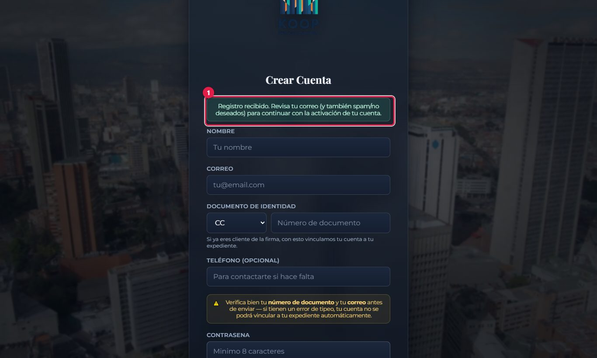

> **Importante:** verifica muy bien tu **número de documento** y tu **correo** antes de enviar. Si tienen un error de digitación, tu cuenta no se podrá vincular a tu expediente automáticamente.

### 8.2 Activar la cuenta

Si tu documento coincide con un cliente de la firma, te llega un correo al **correo que la firma tiene registrado** (no necesariamente al que escribiste ahora) con un botón para **confirmar tu cuenta**. Púlsalo:

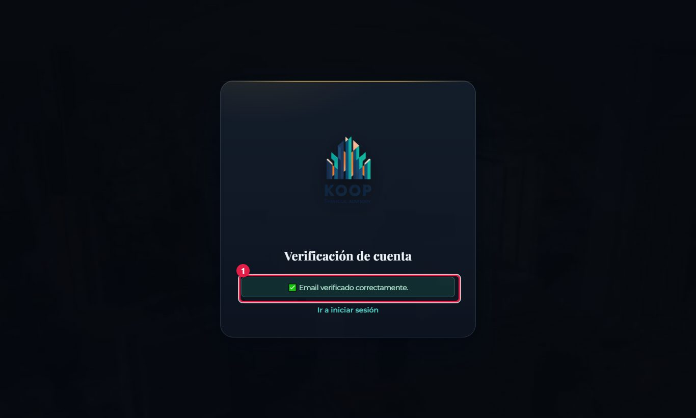

> **Ojo:** el correo llega a la dirección que la firma guardó al crearte como cliente. Esto protege tu información: conocer tu cédula no basta para entrar a tus casos, hace falta tener acceso a tu bandeja.

Si tu documento **no coincide** con ningún cliente, tu cuenta queda **pendiente**: un administrador la revisará y se comunicará contigo. Mientras tanto, si intentas entrar verás *"Cuenta desactivada. Contacta al administrador."*

### 8.3 Ver tus casos

Cuando tu cuenta esté activa, entra con tu correo y contraseña. Verás tu perfil:

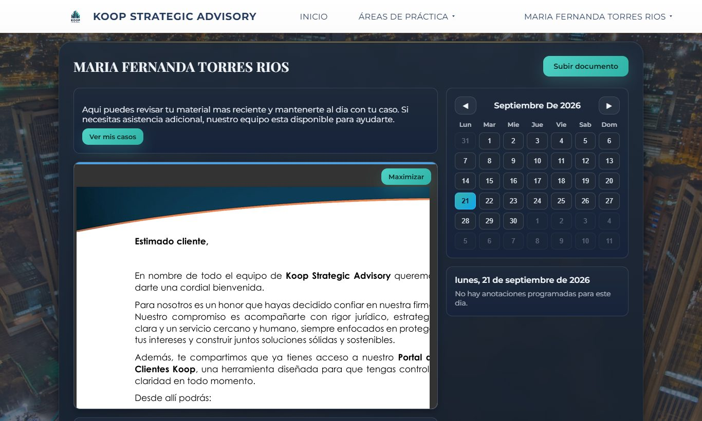

En el menú elige **Mis casos** para ver tus expedientes:

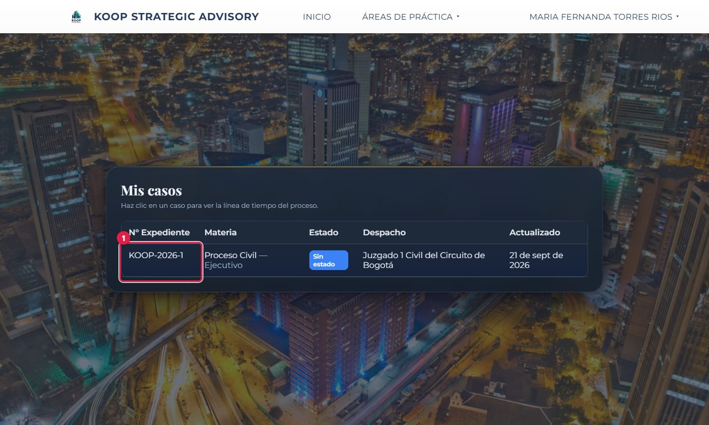

Solo ves **tus** casos y **los documentos que la firma decidió compartir contigo**. Nunca verás información de otros clientes.

---

## 9. Preguntas frecuentes y soluciones

| Problema | Qué hacer |
|---|---|
| **No recuerdo mi contraseña.** | Usa **¿Olvidaste tu contraseña?** en el ingreso (ver 1.2). |
| **Mi cuenta quedó bloqueada.** | Espera 15 minutos o recupera la contraseña. Se bloquea tras 5 intentos fallidos. |
| **No me llega el correo de activación o recuperación.** | Espera un par de minutos y revisa **spam**. Verifica que el correo esté bien escrito. |
| **Dice "Cuenta desactivada".** | Tu cuenta aún no está activada. Confirma el correo o pide a un administrador que la active. |
| **No puedo crear un expediente porque el cliente no aparece.** | Crea primero al cliente (capítulo 2). |
| **No puedo agregar un proceso a la consulta diaria.** | El expediente necesita el **radicado del despacho**. Edítalo y agrégalo. |
| **El botón de la bitácora está desactivado.** | Falta registrar la revisión de algún proceso. Mira cuáles dicen *Pendiente de revisión*. |
| **Dice "Solo puedes registrar o corregir la revisión de hoy".** | Los registros de días anteriores no se modifican: son la constancia. |
| **La consulta automática no encontró mi proceso.** | Verifica que el radicado tenga sus 23 dígitos y sea el de Rama Judicial. |
| **Me equivoqué al registrar una revisión.** | Pulsa **Corregir registro** en la tarjeta (solo el mismo día). |
| **Subí un archivo por error.** | En la pestaña **Documentos** del expediente, pulsa 🗑️ en ese archivo. |
| **Veo el error 404 o una pantalla en blanco.** | Recarga la página con **F5**. Si sigue, cierra sesión, vuelve a entrar y avisa al administrador. |

---

## 10. Glosario

| Término | Significado |
|---|---|
| **Actuación** | Cada paso o decisión que ocurre dentro de un proceso judicial (un auto, una sentencia, un memorial). |
| **Anotación** | Texto que el juzgado agrega para explicar una actuación. |
| **Audiencia** | Diligencia en la que las partes se presentan ante el juez. |
| **Bitácora del día** | El PDF que prueba que se revisaron todos los procesos ese día. |
| **Contraparte** | La parte contraria en el proceso. |
| **Expediente** | El folder digital de un caso, con su número interno KOOP (ej. KOOP-2026-1). |
| **Materia** | El tipo de caso: proceso civil, laboral, penal… con su subtipo y pretensión. |
| **Radicado** | El número de 23 dígitos que el juzgado asigna a un proceso. Es distinto del número KOOP. |
| **Rama Judicial** | La entidad cuyo portal público permite consultar procesos. Es el único que la plataforma consulta automáticamente. |
| **Término** | Plazo legal para hacer algo (por ejemplo, contestar una demanda). |
| **Despacho / juzgado** | La oficina judicial que lleva el proceso. |
| **Prospecto** | Persona que se registró pero aún no es cliente de la firma. |

---

*Este manual se genera automáticamente a partir de la plataforma en funcionamiento: las imágenes se capturan con las mismas pruebas automáticas que verifican el sistema, así que siempre reflejan cómo se ve hoy.*
